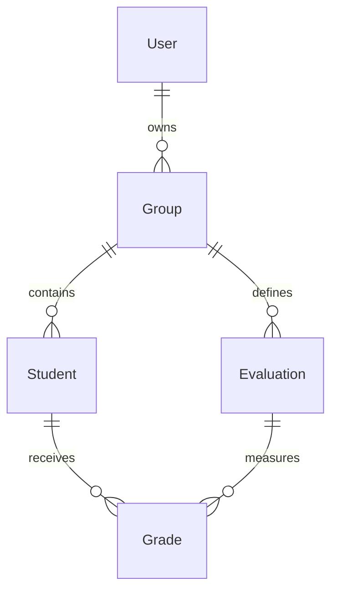

# Notas SaaS para Profesores

Aplicacion web full-stack para que profesores gestionen grupos, estudiantes, evaluaciones y notas en una interfaz tipo Excel, con calculo ponderado automatico, autenticacion por JWT y estructura preparada para crecer como SaaS.

## 1. Stack del proyecto

- Frontend: React + Vite + Tailwind CSS
- Backend: Node.js + Express
- Base de datos: PostgreSQL
- ORM: Prisma
- Autenticacion: JWT
- Exportaciones: Excel con `xlsx` y PDF con `pdfkit`

## 2. Estructura del proyecto

```text
Notas/
├── client/
│   ├── src/
│   │   ├── api/
│   │   ├── components/
│   │   ├── context/
│   │   ├── pages/
│   │   └── styles/
│   ├── .env.example
│   └── package.json
├── server/
│   ├── prisma/
│   │   ├── schema.prisma
│   │   └── seed.js
│   ├── src/
│   │   ├── config/
│   │   ├── controllers/
│   │   ├── middleware/
│   │   ├── routes/
│   │   ├── services/
│   │   └── utils/
│   ├── .env.example
│   └── package.json
├── docker-compose.yml
└── README.md
```

## 3. Modelo de base de datos

### Tablas principales

#### `User`
- Guarda los profesores.
- Cada usuario tiene su propio espacio de trabajo.

Campos clave:
- `id`
- `fullName`
- `email`
- `passwordHash`

#### `Group`
- Representa un curso o grupo academico.
- Pertenece a un solo profesor.

Campos clave:
- `id`
- `name`
- `description`
- `teacherId`

#### `Student`
- Representa un estudiante dentro de un grupo.

Campos clave:
- `id`
- `fullName`
- `identification`
- `groupId`

#### `Evaluation`
- Representa una actividad calificable.
- Tiene nombre, porcentaje, tipo y orden visual.

Campos clave:
- `id`
- `name`
- `percentage`
- `type`
- `order`
- `groupId`

#### `Grade`
- Guarda la nota de un estudiante en una evaluacion.
- Relacion unica entre estudiante y evaluacion.

Campos clave:
- `id`
- `value`
- `studentId`
- `evaluationId`

### Relaciones

- Un `User` tiene muchos `Group`
- Un `Group` tiene muchos `Student`
- Un `Group` tiene muchos `Evaluation`
- Un `Student` tiene muchas `Grade`
- Un `Evaluation` tiene muchas `Grade`
- Un `Grade` conecta un estudiante con una evaluacion

### Relacion visual



## 4. API REST del backend

Base URL: `http://localhost:4000/api`

### Autenticacion

- `POST /auth/register`
- `POST /auth/login`
- `GET /auth/me`

### Grupos

- `GET /groups`
- `POST /groups`
- `GET /groups/:groupId`
- `PUT /groups/:groupId`
- `DELETE /groups/:groupId`

### Estudiantes

- `POST /groups/:groupId/students`
- `PUT /groups/:groupId/students/:studentId`
- `DELETE /groups/:groupId/students/:studentId`

### Evaluaciones

- `POST /groups/:groupId/evaluations`
- `PUT /groups/:groupId/evaluations/:evaluationId`
- `DELETE /groups/:groupId/evaluations/:evaluationId`

### Notas

- `PUT /groups/:groupId/students/:studentId/evaluations/:evaluationId/grade`

### Exportaciones

- `GET /groups/:groupId/export/excel`
- `GET /groups/:groupId/export/pdf`
- `POST /groups/:groupId/import/excel`

## 5. Flujo funcional de la app

1. El profesor se registra o inicia sesion.
2. El frontend guarda el JWT y lo envia en cada peticion protegida.
3. El backend valida el token y filtra todo por `teacherId`.
4. El profesor crea grupos.
5. Dentro de cada grupo agrega estudiantes y evaluaciones.
6. La tabla muestra:
   - Filas: estudiantes
   - Columnas: evaluaciones
   - Ultima columna: nota final ponderada
7. Al escribir una nota entre `0.0` y `5.0`, se guarda automaticamente.
8. El sistema recalcula y colorea la nota final:
   - `0.0 - 2.9`: rojo
   - `3.0 - 4.0`: naranja
   - `4.1 - 5.0`: verde
9. El profesor puede exportar a Excel, editar el archivo y reimportarlo para cargar notas masivamente.

## 6. Ejemplo visual de la tabla interactiva

```text
+----------------------+---------+---------+----------+------------+
| Estudiante           | Quiz 1  | Tarea   | Parcial  | Nota final |
+----------------------+---------+---------+----------+------------+
| Ana Maria Torres     | 4.5     | 4.2     | 4.7      | 4.51       |
| Carlos Perez         | 3.2     | 3.8     | 2.9      | 3.19       |
| Laura Medina         | 4.9     | 4.6     | 4.8      | 4.76       |
+----------------------+---------+---------+----------+------------+
```

## 7. Instrucciones para ejecutar el proyecto

## Requisitos previos

- Node.js 20 o superior
- Docker Desktop o PostgreSQL instalado localmente

### Paso A. Levantar PostgreSQL

Desde la raiz del proyecto:

```bash
docker compose up -d
```

Si prefieres una base local manual, crea una base llamada `notas_saas`.

### Paso B. Configurar backend

```bash
cd server
copy .env.example .env
npm install
npx prisma generate
npx prisma migrate dev --name init
npm run seed
npm run dev
```

Servidor esperado:

```text
http://localhost:4000
```

### Paso C. Configurar frontend

En otra terminal:

```bash
cd client
copy .env.example .env
npm install
npm run dev
```

### Paso D. Ejecutar pruebas

Si acabas de actualizar el proyecto, vuelve a instalar dependencias en `server` y `client` porque ahora hay librerias de testing.

Backend:

```bash
cd server
npm install
npm test
```

Frontend:

```bash
cd client
npm install
npm test
```

## Formato de importacion Excel

La importacion usa la primera hoja del archivo y espera estas columnas:

- `Estudiante`
- `Identificacion`
- una o mas columnas de evaluacion con formato `Nombre (20%)`

Ejemplo:

```text
Estudiante | Identificacion | Quiz 1 (20%) | Tarea 1 (30%) | Parcial (50%)
Ana Lopez  | 1001           | 4.5          | 4.0           | 4.7
Luis Rios  | 1002           | 3.8          | 3.5           | 4.1
```

Reglas importantes:

- Si la evaluacion ya existe en el grupo, se reutiliza.
- Si no existe, se crea automaticamente como `CUSTOM`.
- La importacion no permite notas fuera del rango `0.0 - 5.0`.
- La importacion no permite crear evaluaciones que hagan que el total supere el `100%`.
- La columna `Nota final` se ignora si viene en el archivo.
- La mejor forma de importar es exportar primero el Excel desde la app, editarlo y volverlo a subir.

Frontend esperado:

```text
http://localhost:5173
```

### Usuario demo

- Correo: `profe@demo.com`
- Contrasena: `Profesor123*`

## 8. Componentes principales del frontend

### Layout y acceso

- `AuthShell`: base visual para login y registro
- `ProtectedRoute`: bloquea rutas si no hay token
- `AuthContext`: maneja sesion, perfil y logout

### Dashboard

- `DashboardPage`: orquesta grupos, detalle del grupo y acciones del panel
- `GroupSidebar`: lista de grupos del profesor
- `StatCard`: resumen visual del curso
- `GradebookToolbar`: filtros, orden y exportacion
- `GradebookTable`: tabla principal editable tipo Excel
- `StudentsManager`: listado visual con acciones de editar y eliminar estudiantes
- `EvaluationsManager`: gestion visual de actividades evaluativas
- `EntityFormModal`: modales reutilizables para crear y editar grupos, estudiantes y evaluaciones

## 9. Buenas practicas aplicadas

- Separacion clara entre frontend y backend
- Prisma para acceso tipado y mantenible a datos
- Middleware de autenticacion reusable
- Validacion de rango de notas en backend
- Restriccion multiusuario por `teacherId`
- Manejo centralizado de errores
- Componentes reutilizables y UI desacoplada
- Variables de entorno para configuraciones sensibles
- Seed inicial para acelerar pruebas
- Base inicial de pruebas automatizadas en backend y frontend

## 10. Validaciones implementadas

- No se permiten notas fuera del rango `0.0 - 5.0`
- No se permite que la suma de porcentajes supere `100%`
- La interfaz avisa cuando el total aun no llega al `100%`
- No se puede editar informacion de otro profesor

## 11. Como convertirlo en un SaaS real

### Multiusuario serio

- Agregar roles: admin, coordinador, profesor
- Incluir organizaciones o instituciones educativas
- Separar datos por `tenantId`

### Pagos

- Integrar Stripe o Mercado Pago
- Crear planes:
  - Free: pocos grupos
  - Pro: exportaciones y analytics
  - School: multi-sede y usuarios por institucion

### Operacion y escalabilidad

- Deploy del frontend en Vercel o Netlify
- Deploy del backend en Railway, Render o Fly.io
- PostgreSQL administrado en Neon, Supabase o RDS
- Almacenamiento de reportes en S3
- Colas para exportaciones pesadas

## 12. Mejoras futuras recomendadas

- Reportes de desempeno por grupo y por estudiante
- Boletines automaticos por periodo
- Dashboard con analytics y alertas tempranas
- Importacion masiva desde Excel
- Historial de cambios de notas
- Comentarios cualitativos por estudiante
- Version movil con React Native
- Notificaciones por correo o WhatsApp
- Firma digital de actas

## 13. Archivos clave para revisar primero

- [schema.prisma](C:/Users/juand/Desktop/Notas/server/prisma/schema.prisma)
- [app.js](C:/Users/juand/Desktop/Notas/server/src/app.js)
- [group.service.js](C:/Users/juand/Desktop/Notas/server/src/services/group.service.js)
- [DashboardPage.jsx](C:/Users/juand/Desktop/Notas/client/src/pages/DashboardPage.jsx)
- [GradebookTable.jsx](C:/Users/juand/Desktop/Notas/client/src/components/grades/GradebookTable.jsx)

## 14. Siguientes pasos profesionales

Si quieres llevarlo a una siguiente version realmente comercial, el mejor orden seria:

1. Pruebas automatizadas en backend y frontend.
2. Importacion masiva desde Excel.
3. Roles por institucion.
4. Facturacion SaaS y panel administrativo.
5. Auditoria e historial de cambios por nota.

## 15. Despliegue a produccion

La forma mas simple para este proyecto es desplegarlo en Render como una sola app Node que:

- sirve la API Express
- sirve el frontend compilado de React
- usa una base PostgreSQL administrada

### Lo que ya quedo preparado

- [render.yaml](C:/Users/juand/Desktop/Notas/render.yaml): blueprint para crear app y base de datos
- [app.js](C:/Users/juand/Desktop/Notas/server/src/app.js): sirve `client/dist` en produccion
- [http.js](C:/Users/juand/Desktop/Notas/client/src/api/http.js): usa `/api` por defecto en produccion

### Pasos recomendados

1. Sube el proyecto a GitHub.
2. En Render, elige `New +` > `Blueprint`.
3. Conecta tu repositorio.
4. Render detectara `render.yaml` y te mostrara:
   - una web app `notas-saas-app`
   - una base PostgreSQL `notas-saas-db`
5. Define la variable secreta `JWT_SECRET`.
6. Lanza el deploy.

### Variables importantes en Render

- `NODE_ENV=production`
- `DATABASE_URL`: la inyecta Render desde la base de datos
- `JWT_SECRET`: debes configurarla tu
- `CORS_ORIGINS`: opcional si usas el mismo dominio para frontend y backend
- `APP_URL`: URL publica de tu app, por ejemplo `https://tuapp.onrender.com`
- `RESEND_API_KEY`: API key de Resend para enviar correos reales
- `EMAIL_FROM`: remitente verificado en Resend

### Nota importante sobre Prisma en este proyecto

El proyecto ya incluye migraciones de Prisma en `server/prisma/migrations`, por lo que en produccion el arranque usa:

```bash
npm run migrate:deploy
```

Eso aplica el esquema versionado a la base de datos antes de levantar la API.

### Despues del primer deploy

1. Abre la URL publica de la app.
2. Registra un profesor nuevo o crea un seed manual desde consola si lo necesitas.
3. Prueba login, creacion de grupo, carga de notas y exportacion.
4. Configura recuperacion de contrasena con Resend antes de invitar usuarios reales.

### Si quieres dominio propio

En Render puedes conectar tu dominio y apuntar los DNS desde tu proveedor. Cuando eso quede listo, la app funcionara en esa URL publica.

## 16. Recuperacion de contrasena

La app ya incluye:

- pantalla `Olvide mi contrasena`
- generacion de token temporal seguro
- expiracion del enlace en 1 hora
- pantalla para crear nueva contrasena
- envio de correo con Resend

### Variables necesarias

En local o en Render configura:

```env
APP_URL="https://tu-dominio-o-url-publica"
RESEND_API_KEY="re_xxxxxxxxx"
EMAIL_FROM="Tu App <no-reply@tu-dominio.com>"
```

### Flujo

1. El usuario escribe su correo en `/forgot-password`.
2. El backend genera un token, guarda su hash y su expiracion.
3. Se envia un enlace tipo:

```text
https://tuapp.com/reset-password?token=abc123
```

4. El usuario abre ese enlace y define una nueva contrasena.

### Desarrollo local

Si `RESEND_API_KEY` no esta configurada, el backend no enviara el correo real y en desarrollo devolvera el link temporal en la respuesta para que puedas probar el flujo.
